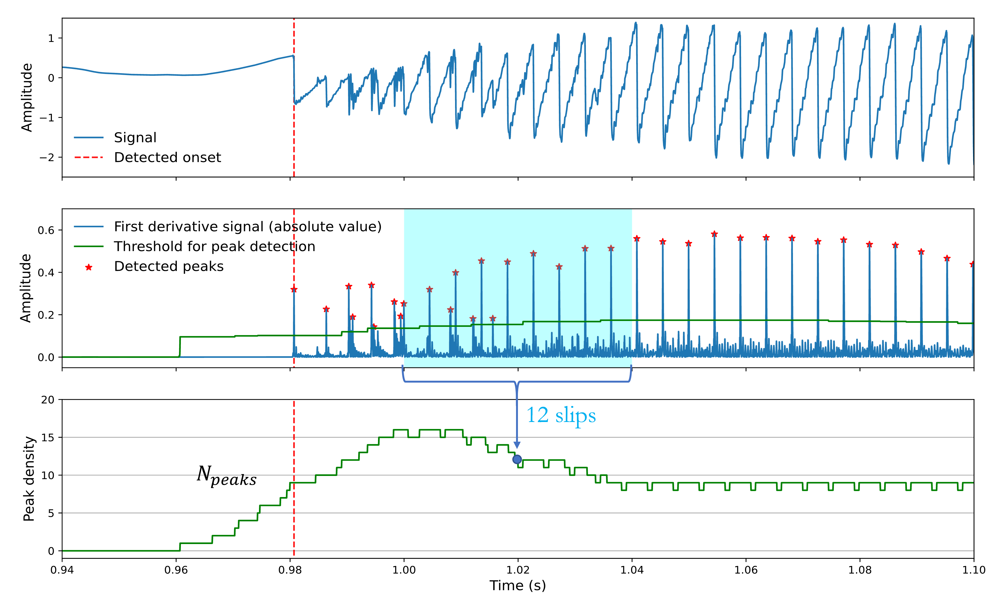

# transient_detection
Algorithm to detect transient regimes in bowed-string force signals on a cello bridge.

## Method

Automatic detection works as follows:

### Calculate slips from first difference of signal --> First slip = Transient onset

### Count number of slips for each window

### Calculate mean and std of the peak density function

### Detect end of transient from mean and std

